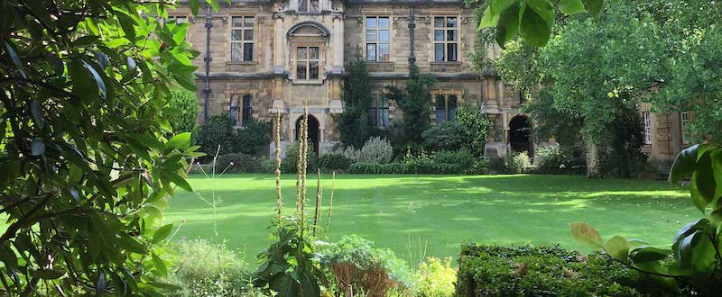

## Workshop on the Role of Computer Science in Forest and Landscape Restoration

There has recently been a surge of interest in using large-scale reforestation
to delay the impact of climate change. We are hosting a half-day brainstorming
workshop to gather input on what might constitute a reasoned response to this
interest from the University of Cambridge. We envision that such a response
would be informed by the discipline of Forest Landscape Restoration but would
draw upon computing technologies, broadly defined.

### Arrangements

* **Date:** 31st March 2020 (1400-1700)
* **Location:** [Pembroke College Cambridge](https://www.pem.ac.uk), Nihon Room

A buffet lunch will be provided beforehand at the Nihon Room from 1230.  Dinner
is also being arranged for after the workshop.

### Schedule

The schedule is currently being organised, but will consist of a brief
introduction to the existing UCTrees research findings, followed by discussion
sessions on the practise of planning, deploying and sustaining reforestation
efforts.
